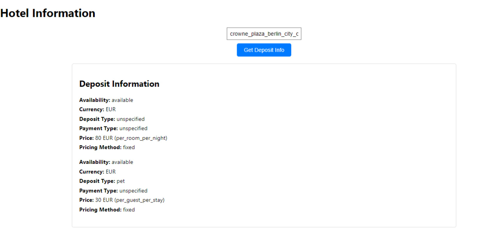

# Hotel Search

This project enables users to input a hotel name, which is then searched for across two separate APIs. The system subsequently displays the minimum price found for that particular hotel.

The frontend of the project is developed using ReactJS, offering a user-friendly interface for entering the hotel name and showcasing the search results.

On the backend, Node.js and Express.js are employed to manage the search functionality. These technologies facilitate communication with the two APIs, retrieving data about the specified hotel from each source.

By aggregating the results from both APIs, the system determines the minimum price for the searched hotel, ensuring users can effortlessly find the best available deal.

The preview provides a glimpse of the user interface of the hotel search application. It features a search bar where users can input the name of the hotel they wish to search for. Beneath the search bar lies a button labeled "Search" to initiate the search process. Once the search is concluded, the interface presents the results, including the hotel name, location, and the minimum price found across the two APIs. Additionally, users have the option to refine their search criteria, such as selecting dates and specifying the number of guests.

The Hotel Search project offers users a seamless experience to discover the best deals for their preferred accommodations. The frontend, powered by ReactJS, ensures a smooth and intuitive interface for users to input their hotel preferences and view search results.

On the backend, Node.js and Express.js manage the heavy lifting, orchestrating communication between the frontend and the APIs of two leading hotel booking platforms. Leveraging the APIs' capabilities, the backend retrieves comprehensive data about the specified hotel, including availability and pricing information.

The search functionality aggregates data from both APIs and computes the minimum price for the searched hotel, ensuring users are presented with the most competitive rates available.

The preview showcases the application's clean and modern design, emphasizing user experience and efficiency. With intuitive navigation and informative visuals, users can easily discover and compare hotel options, ultimately making informed decisions based on their preferences and budget.

